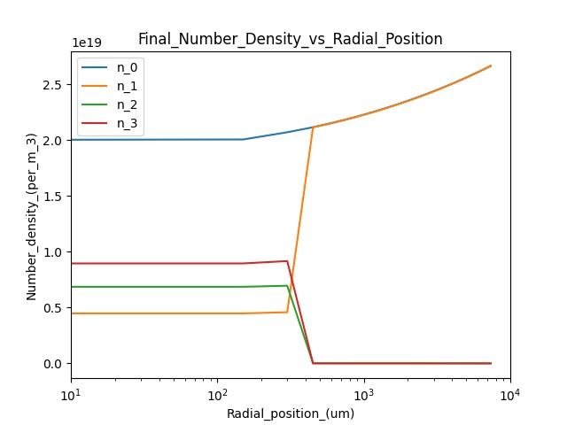
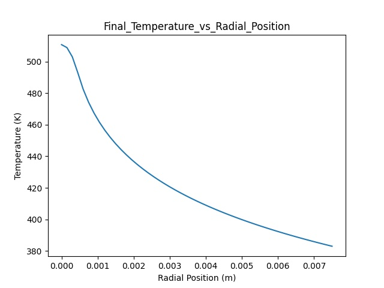
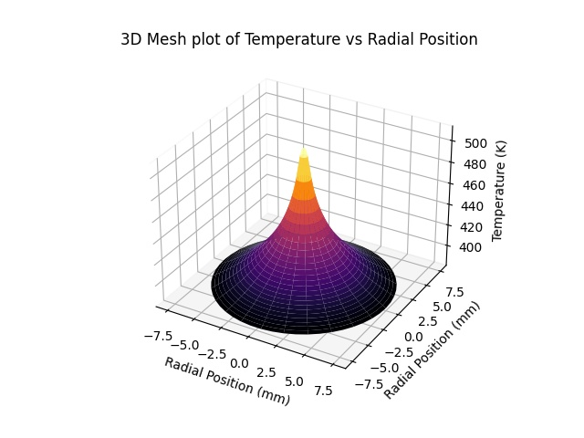

# Final Year Project

This repository is my implementation of [J. Han, Y. Wang, H. Cai, W. Zhang, L. Xue, and H. Wang, "Algorithm for evaluation of temperature distribution of a vapor cell in a diode-pumped alkali laser system: part I," Opt. Express 22, 13988-14003 (2014).
](https://doi.org/10.1364/OE.22.013988). and  [Juhong Han, You Wang, He Cai, Guofei An, Wei Zhang, Liangping Xue, Hongyuan Wang, Jie Zhou, Zhigang Jiang, and Ming Gao, "Algorithm for evaluation of temperature distribution of a vapor cell in a diode-pumped alkali laser system (part II)," Opt. Express 23, 9508-9515 (2015)
](https://doi.org/10.1364/OE.23.009508)

## Requirements

To install the requirements, create a virtual environment and run:

```setup
pip install -r requirements.txt
```

## Usage

The code can either take input via a file which is passed as a command line argument, or the input can be entered manually

```usage
python run.py inputs/1.txt
```
or

```usage
python run.py
```
If the user enters 'y' when asked if the gas is flowing, then the code implements the second paper else if the input is 'n' then the first paper is implemented.

## Results

The code creates 3 plots, showing:
* Final Number Density vs Radial Position
* Final Temperature vs Radial Position
* 3D Heatmap of Temperature vs Radial Position

and two files containing resulting values of Temperature and Lasing Power




